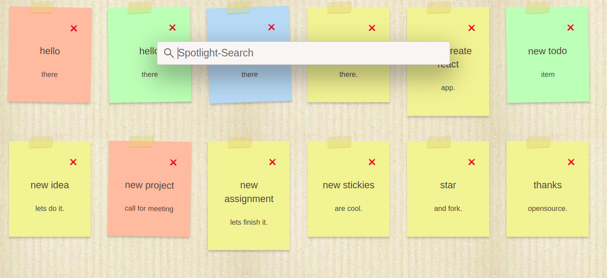

<h1> Stickies - TODO</h1>
Simple todo list with sticky notes. 
   
   
  

  
 

## Demo link:
Access my site at [link](https://62651a17dcafd97e7268c695--cerulean-cranachan-0bafae.netlify.app/)

## Table of Content:

- [About The App](#about-the-app)
- [Screenshots](#screenshots)
- [Technologies](#technologies)
- [Setup](#setup)
- [Approach](#approach)
- [Status](#status)
- [Credits](#credits)
- [License](#license)

## About The App
As the name suggests it is basically a todo list using sticky notes. I wanted to use digital sticky notes wall using `react`. And also, input forms takes lots of space on wall which I didn't wanted. So, I have added spotlight to add new stickies. just hit
<kbd> ctrl </kbd> + <kbd> Enter </kbd> type `task,description.` in this format only. then done.

## Screenshots

## Technologies
I used `react` `html`, `css`.

## Setup And Usage
- download or clone the repository
- run `npm install`
- run `npm start`
- go to localhost, and u can see the start page for stickies TODO
- hit ctrl + enter to open up spotlight add `todo item,description`
- it will add the new sticky note on the wall.

## Approach
I adopted the `BEM` naming style for my css class names and used eslint `airbnb` style guide.

## Status
Stickies - TODO is completed with basic features. You can request for new features. or Fork and create PR for the same. `Version 2` will be out soon after adding new features.

## Credits
List of contriubutors:
- [Ashish Pawar](https://github.com/ashishpawar517)

## License

MIT license @ [Ashish Pawar](https://github.com/ashishpawar517)
